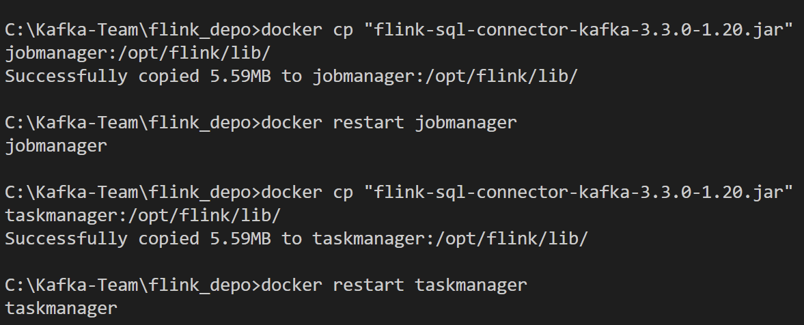
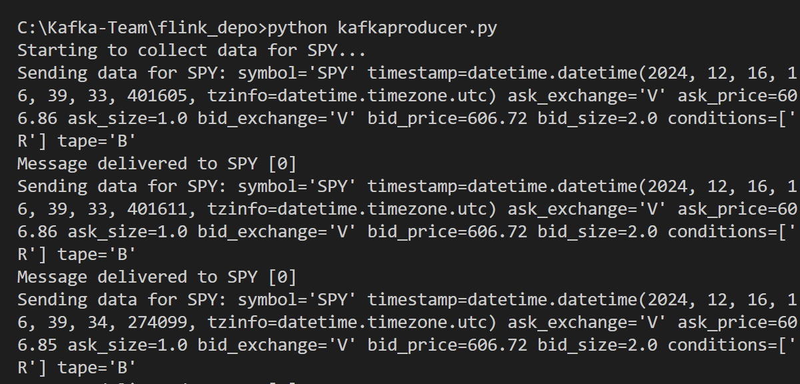
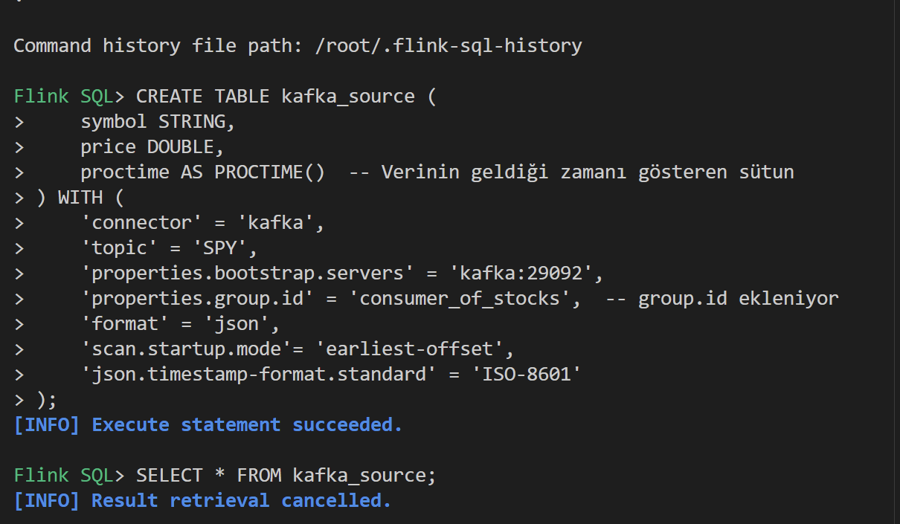
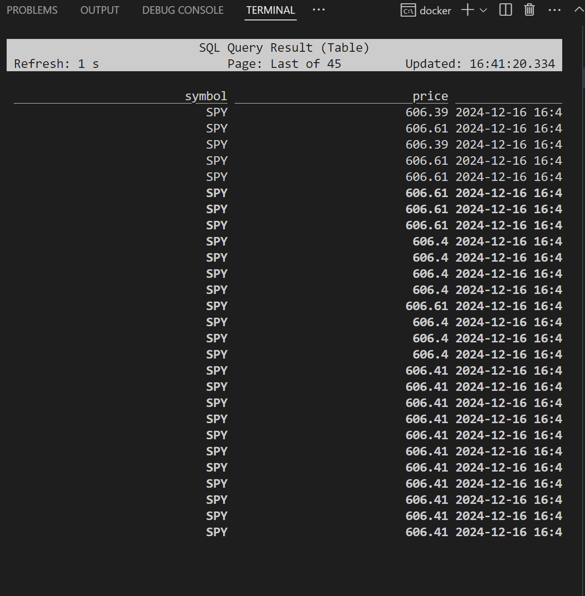
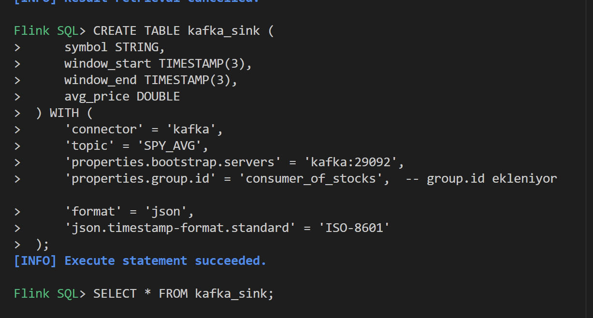
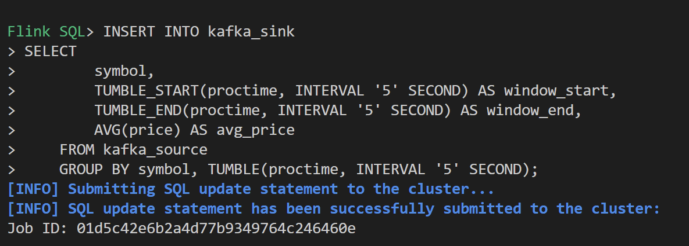
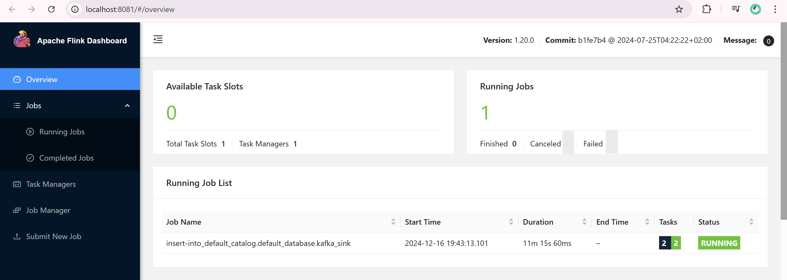
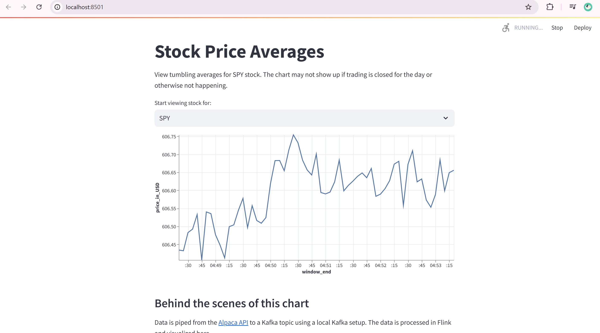
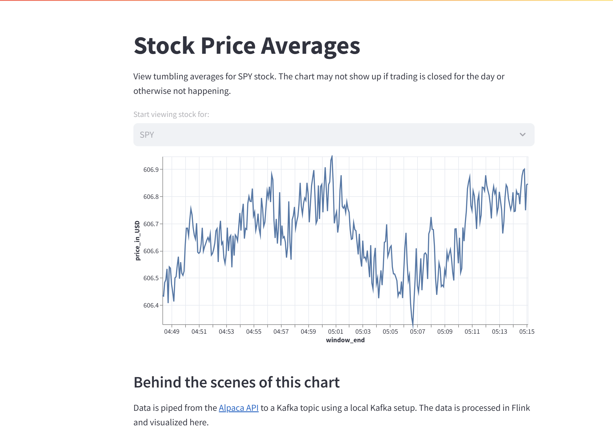

 

# How to use FlinkSQL with Kafka, Streamlit, and the Alpaca API


Learn how to use these 4 technologies together by running this demo yourself! 

In this project you'll produce stock trade events from the [Alpaca API markets](https://app.alpaca.markets) websocket to an [Apache Kafka](https://kafka.apache.org/) topic located in your local computer From there, use [FlinkSQL](https://nightlies.apache.org/flink/flink-docs-master/docs/dev/table/sql/overview/) in  local  to generate 5 sec averages of stock prices over a tumbling window. Then, you'll consume the averages from a backup Kafka topic and display them using [Streamlit](https://streamlit.io/). 


Note: Although it may change in the future, at the time this README was written, the NYSE is open from 9:30 to 4 EST. If you run this application outside of those hours, you may not see data coming through.


# To clone this repo 
```
git clone https://github.com/zehranurr/demo-flink-streamlit.git


```
# install library 
```
pip install requirements.txt

```
# Run docker-compose
```
docker-compose up --build

```

# To  copy jar
## Firstly copy to jobmanager
-  docker cp "flink-sql-connector-kafka-3.3.0-1.20.jar" jobmanager:/opt/flink/lib/
## Then restart jobmanager container 
- docker restart ID(jobmanager)
## Second copy to taskmanager
- docker cp "flink-sql-connector-kafka-3.3.0-1.20.jar" taskmanager:/opt/flink/lib/
## Then restart taskmanager container 
- docker restart id


* 


# Create topic 
## Enter kafka container then create those 2 topics
- docker exec -it kafka /bin/bash 
- kafka-topics --create --topic SPY --bootstrap-server localhost:9092 --partitions 1 --replication-factor 1
- kafka-topics --create --topic SPY_AVG  --bootstrap-server localhost:9092 --partitions 1 --replication-factor 1

## to be sure topics created run this 
- kafka-topics --list --bootstrap-server localhost:9092

## to listen topics
- docker exec -it id kafka-console-consumer --bootstrap-server localhost:9092 --topic SPY_AVG --from-beginning
- kafka-console-consumer --bootstrap-server localhost:9092 --topic SPY --from-beginning


# Run kafka producer
```
python kafkaproducer.py 

```



#  Running SQL Queries Using Flink SQL Client
- docker exec -it jobmanager /bin/bash
- ./bin/sql-client.sh


# To create this table 

flink : DROP TABLE kafka_sink;

```

CREATE TABLE kafka_source (
    symbol STRING,
    price DOUBLE,
    proctime AS PROCTIME()  -- Verinin geldiği zamanı gösteren sütun
) WITH (
    'connector' = 'kafka',
    'topic' = 'SPY',
    'properties.bootstrap.servers' = 'kafka:29092',
    'properties.group.id' = 'consumer_of_stocks',  -- group.id ekleniyor
    'format' = 'json',
    'scan.startup.mode'= 'earliest-offset',
    'json.timestamp-format.standard' = 'ISO-8601'
);

```

```
## First Table 
CREATE TABLE kafka_source (
        symbol STRING,
        price DOUBLE,
        proctime AS PROCTIME()  -- Verinin geldiği zamanı gösteren sütun        
    ) WITH (
        'connector' = 'kafka',
        'topic' = 'SPY',
        'properties.bootstrap.servers' = 'kafka:29092',
        'properties.group.id' = 'consumer_of_stocks',  -- group.id ekleniyor    
        'format' = 'json',
        'scan.startup.mode'= 'earliest-offset',
        'json.timestamp-format.standard' = 'ISO-8601'
    );

```

* check table 

```
## Second Table 
CREATE TABLE kafka_sink (
     symbol STRING,
     window_start TIMESTAMP(3),
     window_end TIMESTAMP(3),
     avg_price DOUBLE
 ) WITH (
     'connector' = 'kafka',
     'topic' = 'SPY_AVG',
     'properties.bootstrap.servers' = 'kafka:29092',
     'properties.group.id' = 'consumer_of_stocks',  -- group.id ekleniyor    
     'format' = 'json',
     'json.timestamp-format.standard' = 'ISO-8601'
 );
```

```
## Connection
INSERT INTO kafka_sink
SELECT
        symbol,
        TUMBLE_START(proctime, INTERVAL '5' SECOND) AS window_start,
        TUMBLE_END(proctime, INTERVAL '5' SECOND) AS window_end,
        AVG(price) AS avg_price
    FROM kafka_source
    GROUP BY symbol, TUMBLE(proctime, INTERVAL '5' SECOND);

   
```


## We can look Apache flink dashbord on local localhost:8081



# To run Streamlit
```


 streamlit run app.py

```



* When we run first time 



* after time it will look like 